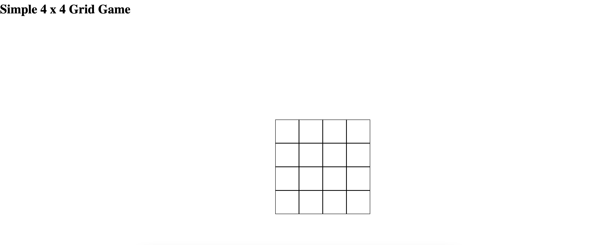

# Frontend Assignment

There are 2 frontend tasks described below.
Each of the task has a basic UI skeleton which is open for improvement/enhancement.

  
Task 1

  
  ## Simple 4x4 Grid Game
`npm i` and then `npm start`, go t0 `http://localhost:3000`, you will see below UI for Task 1 tab

[]

## Tasks

-   User should be able to click on any box from the grid,
-   Clicked box should become of color red and box should also display the `Box ${click_number}`,
-   At any given point only 2 boxes (most recently clicked) should be in red color, all previously clicked boxes should turn blue,
-   Once a box is clicked , user should not be able to click on it again.

-   Used an array to store clicked box's Id.
-   Leveraged the same array's index as the click counter
-   Used existing map, to decide what type of box to show
-   Used one if-else instead of a ternary operation, so multiple checks are not done internally
    -   For example, `clickedIds.findInex` check is only done once, on using ternary operation, we would have ended up running the same check atleast thrice

  
Task 2

  
  ## Phone Book
`npm i` and then `npm start`, go t0 `http://localhost:3000`, you will see below UI for Task 2 tab

[]

## Tasks

-   Allow user to add entries to phonebook and display in table below,
-   Alert error when duplicate first and last name,
-   Add ability to remove records from the phone book

-   Used `useReducer` so its easier to cleanly specify form actions and if and when need actions need to be added it will be easier
-   Used uncontrolled form elements, only to showcase how we can use primitive html/js code with react.
    -   Of course, the other way would have been to use a few `useState`s or even use existing useReducer to set state value of form input elements
-   Added a few validations for the form, and the check for duplicate record is added at the action level.
-   Added a unique id to each record so it becomes easier to delete record.

## Criteria

-   Cleanliness of the code
-   Use modern ES6+ syntax, async/await, elegant & readable code
-   All the edgecases have been handled
-   Tests are not needed but will be a big plus
-   README.md file explaining your high level solution and any decisions you made and the reasons behind them

## How to submit

-   Clone this repository in your local machine,
-   Complete the task and upload to github,
-   Share your public repo link with us.
